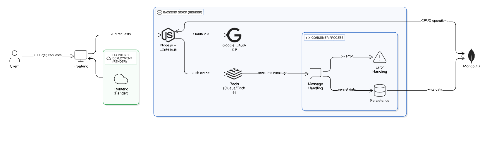

# Xeno Backend

Backend for **Xeno** — a Node.js + Express API with Redis and MongoDB.

---

## Table of Contents

- [Xeno Backend](#xeno-backend)
  - [Table of Contents](#table-of-contents)
  - [About](#about)
  - [Local Setup Instructions](#local-setup-instructions)
  - [Architecture](#architecture)
  - [API Endpoints](#api-endpoints)
  - [Tech Stack \& Tools Used](#tech-stack--tools-used)
  - [Known Limitations / Assumptions](#known-limitations--assumptions)
    - [Assumptions](#assumptions)
    - [Limitations](#limitations)
    - [Future Improvements](#future-improvements)

---

## About

This is the backend portion of the *Xeno* project. It is built using Node.js, Express, MongoDB (for persistence), and Redis Streams (for event handling).  
It provides RESTful APIs for authentication, customer management, and analytics segments.

---

## Local Setup Instructions

Follow these steps to run the backend locally:

1.  **Clone the repository**

    ```bash
    git clone [https://github.com/DhruvAgrawal511/xeno-backend.git](https://github.com/DhruvAgrawal511/xeno-backend.git)
    cd xeno-backend
    ```

2.  **Install dependencies**

    Ensure you have Node.js (preferably current LTS) installed. Then run:
    ```bash
    npm install
    ```

3.  **Set up environment variables**

    Create a `.env` file at the root with values like:
    ```env
    PORT=5000
    MONGO_URI=mongodb://localhost:27017/xeno
    REDIS_URL=redis://localhost:6379
    JWT_SECRET=your-secret-key
    ```

4.  **Run the development server**

    ```bash
    npm start
    ```
    This will start the Express server (default http://localhost:5000).

5.  **Testing with Postman**

    Import the provided Postman collection (if available) or test APIs manually with:
    - `GET http://localhost:5000/api/health`
    - `POST http://localhost:5000/api/customers`
    - `GET http://localhost:5000/api/customers?page=1&limit=10`

---

## Architecture

Below is a high-level overview of the backend architecture:



---

## API Endpoints

Here’s a quick reference of main routes:

| Method   | Endpoint                    | Description                      | Auth Required |
| :------- | :-------------------------- | :------------------------------- | :------------ |
| `GET`    | `/api/health`               | Health check                     | No            |
| `POST`   | `/api/auth/register`        | Register a new user              | No            |
| `POST`   | `/api/auth/login`           | Login and get JWT token          | No            |
| `GET`    | `/api/auth/me`              | Get logged-in user details       | Yes           |
| `POST`   | `/api/customers`            | Create a new customer            | Yes           |
| `GET`    | `/api/customers`            | List customers (with pagination) | Yes           |
| `PUT`    | `/api/customers/:id`        | Update a customer                | Yes           |
| `DELETE` | `/api/customers/:id`        | Delete a customer                | Yes           |
| `GET`    | `/api/segments`             | Get analytics/customer segmentation | Yes           |

---

## Tech Stack & Tools Used

Here’s a summary of the main backend technologies:

| Category              | Tools / Libraries                   | Purpose                             |
| :-------------------- | :---------------------------------- | :---------------------------------- |
| **Runtime** | Node.js                             | Server runtime                      |
| **Framework** | Express.js                          | REST API framework                  |
| **Database** | MongoDB + Mongoose                  | Persistent storage                  |
| **Caching / Streaming**| Redis (ioredis / node-redis)      | Caching & Redis Streams             |
| **Authentication** | JWT (jsonwebtoken)                  | Token-based authentication          |
| **Validation** | Joi / Validator                     | Request validation                  |
| **Environment Config**| dotenv                              | Load `.env` configs                 |
| **Deployment / Hosting**| Render (Backend) + Vercel (Frontend integration) | Hosting               |

---

## Known Limitations / Assumptions

### Assumptions

-   MongoDB and Redis services are up and running before starting the server.
-   `JWT_SECRET` and other environment variables are properly set in `.env`.
-   CORS is configured to allow frontend domain.

### Limitations

-   No rate limiting is currently implemented.
-   Redis Streams may require proper scaling for high throughput.
-   Limited error handling (500 errors possible if Redis/Mongo not available).
-   Logging is minimal; production setups may need Winston / pino logging.

### Future Improvements

-   Add Docker setup for easy local dev (Mongo + Redis containers).
-   Add Swagger / OpenAPI documentation for endpoints.
-   Add test cases (Jest / Mocha).
-   Add CI/CD pipeline.
-   Add role-based access control.